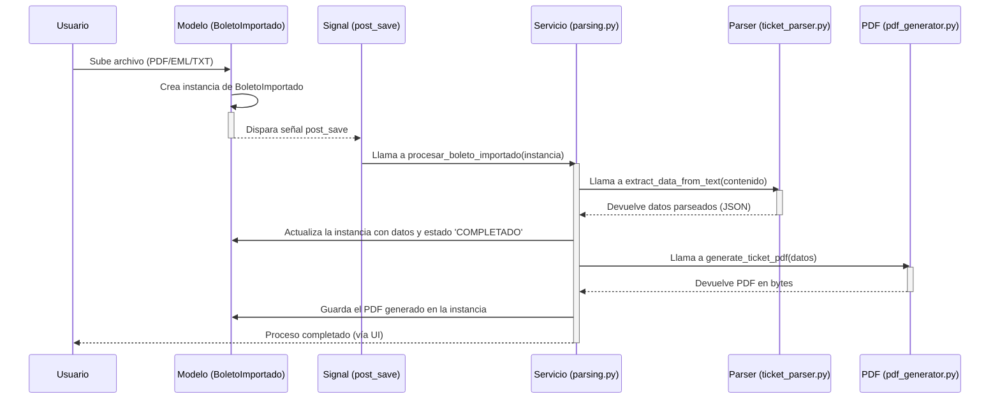

# Arquitectura del Sistema TravelHub

Este documento describe la arquitectura de alto nivel de la aplicación TravelHub, las decisiones clave detrás de su diseño y los flujos de datos principales.

## 1. Visión General

TravelHub está diseñado como una aplicación web moderna con una arquitectura desacoplada, que consiste en:

-   Un **Backend** robusto basado en **Django** y **Django REST Framework (DRF)**, que sirve una API RESTful.
-   Un **Frontend** interactivo de tipo Single-Page Application (SPA) construido con **Next.js (React)**.
-   Una base de datos relacional **PostgreSQL** para la persistencia de datos.
-   Integración con servicios externos como la **API de Google (Gemini)** para funcionalidades de IA.

## 2. Diagrama de Arquitectura

El siguiente diagrama ilustra los componentes principales y sus interacciones:

```mermaid
graph TD
    subgraph Usuario
        A[Navegador Web]
    end

    subgraph "Frontend (Next.js / Vercel)"
        B[Aplicación React]
    end

    subgraph "Backend (Python / Django)"
        C{API RESTful} -- "Lógica de Negocio" --> D[Capa de Servicios]
        D -- "Acceso a Datos" --> E[Modelos Django ORM]
        C -- "Autenticación" --> F[JWT Auth]
    end

    subgraph "Base de Datos"
        G[(PostgreSQL)]
    end

    subgraph "Servicios Externos"
        H[Servidor de Correo (IMAP)]
        I[Google AI (Gemini)]
    end

    A -- "Interactúa con" --> B
    B -- "Llamadas API (HTTPS)" --> C
    E -- "Consultas SQL" --> G
    C -- "Parsea boletos de" --> H
    D -- "Usa IA para..." --> I
```

## 3. Descripción de Componentes

### 3.1. Frontend (`frontend/`)

-   **Tecnología:** Next.js, React, TypeScript, Tailwind CSS.
-   **Responsabilidades:**
    -   Renderizar la interfaz de usuario (UI).
    -   Gestionar el estado del lado del cliente (sesiones de usuario, datos en vivo).
    -   Consumir la API REST del backend para todas las operaciones de datos.
    -   Proporcionar una experiencia de usuario fluida y reactiva.

### 3.2. Backend (`core/` y `travelhub/`)

-   **Tecnología:** Django, Django REST Framework, Gunicorn.
-   **Responsabilidades:**
    -   **API RESTful:** Exponer endpoints seguros para todas las operaciones CRUD (Crear, Leer, Actualizar, Eliminar) sobre los recursos del sistema (Ventas, Clientes, Boletos, etc.).
    -   **Autenticación y Autorización:** Validar las credenciales del usuario a través de JWT y controlar el acceso a los diferentes recursos.
    -   **Lógica de Negocio:** Implementar las reglas de negocio complejas en una **capa de servicios** (ej: `core/services/parsing.py`), desacoplada de los modelos y vistas. Esto incluye el cálculo de totales, la asignación de puntos de fidelidad y el procesamiento de boletos.
    -   **Persistencia de Datos:** Gestionar la interacción con la base de datos a través del ORM de Django.
    -   **Tareas Asíncronas (Planificadas):** La arquitectura está preparada para delegar tareas pesadas (parseo de correos, generación de PDFs) a un sistema de colas como Celery o RQ para no bloquear las solicitudes web.

### 3.3. Base de Datos

-   **Tecnología:** PostgreSQL (producción), SQLite (desarrollo).
-   **Propósito:** Es la fuente única de verdad para todos los datos de la aplicación, incluyendo datos de clientes, ventas, facturas, contenido del CMS y logs de auditoría.

## 4. Flujo de Datos Clave: Ingestión y Parseo de Boletos

Este es el flujo más complejo y representativo del sistema. Muestra cómo los diferentes componentes interactúan para automatizar una tarea de negocio crítica.



**Pasos del Flujo:**

1.  **Carga:** El usuario sube un archivo a través de la interfaz.
2.  **Creación del Modelo:** Se crea un registro en la tabla `BoletoImportado` con el archivo y el estado `PENDIENTE`.
3.  **Disparo del Signal:** La creación del registro dispara una señal `post_save` de Django.
4.  **Invocación del Servicio:** El receptor de la señal (ubicado en `core/apps.py` y que apunta a `core/services/parsing.py`) invoca a la función de servicio `procesar_boleto_importado`, pasando la instancia del modelo.
5.  **Parseo:** El servicio llama al `ticket_parser`, que detecta el GDS y extrae la información en un formato JSON normalizado.
6.  **Generación de PDF:** El servicio utiliza el `pdf_generator` para crear un PDF unificado a partir de los datos normalizados.
7.  **Actualización:** El servicio actualiza la instancia original del `BoletoImportado` con los datos parseados, el PDF generado y el estado `COMPLETADO` o `ERROR`.

## 5. Decisiones Arquitectónicas Clave (ADRs)

-   **API Desacoplada:** Se eligió una arquitectura de API REST + SPA para separar las responsabilidades del frontend y el backend, permitiendo un desarrollo independiente y una mayor flexibilidad.
-   **Autenticación con JWT:** Se utiliza JWT para la autenticación de la API por ser un estándar moderno, eficiente y sin estado, ideal para SPAs y clientes móviles.
-   **Capa de Servicios:** La lógica de negocio se está moviendo de los modelos y vistas a una capa de servicios dedicada. Esta decisión mejora la testeabilidad, reduce el acoplamiento y hace que el código sea más fácil de mantener y reutilizar.
-   **Modularización Progresiva:** En lugar de una reescritura completa, se está refactorizando el código monolítico (especialmente `core/models.py`) de forma incremental y segura, utilizando patrones como la importación dinámica en `__init__.py` para no romper la funcionalidad existente.
