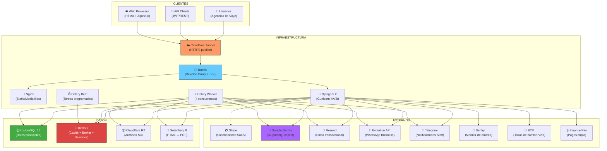
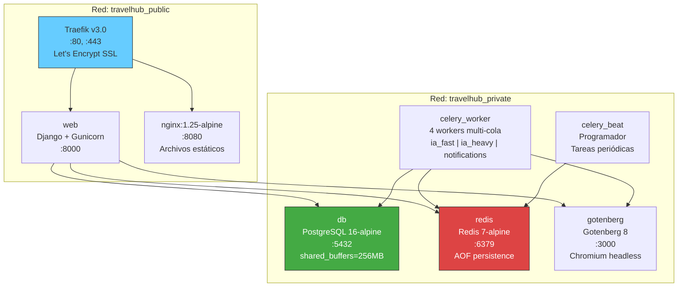
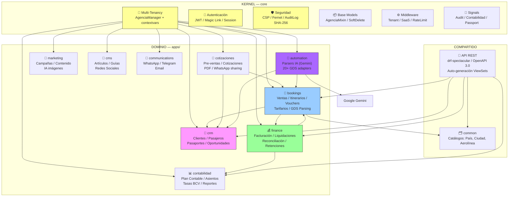
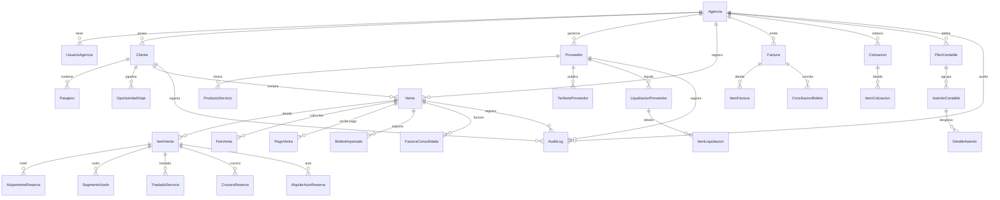
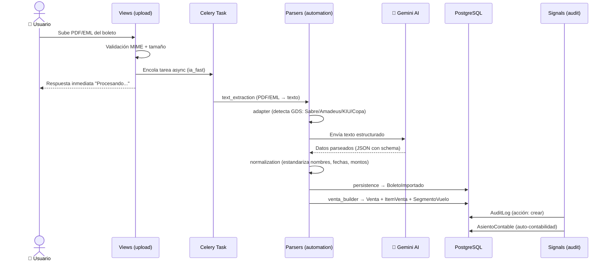
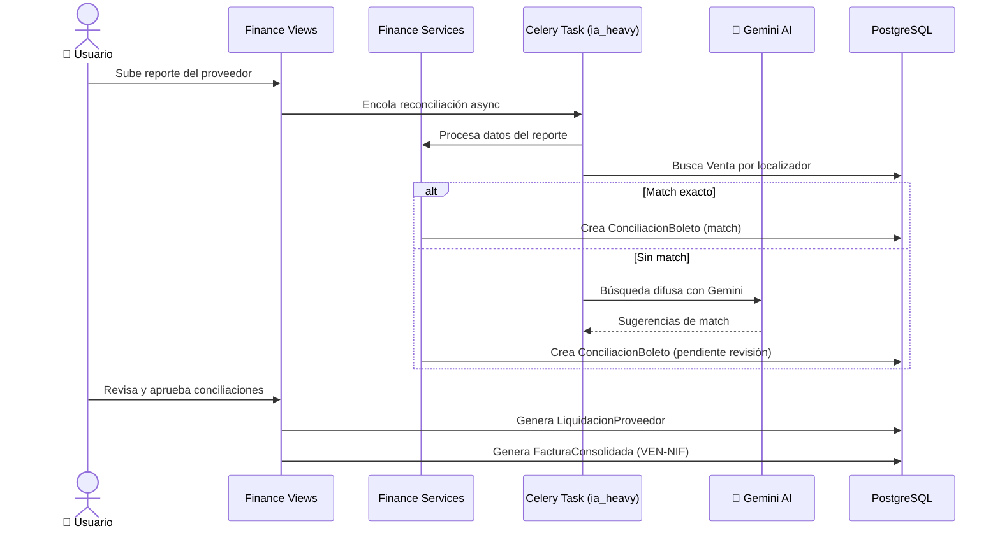
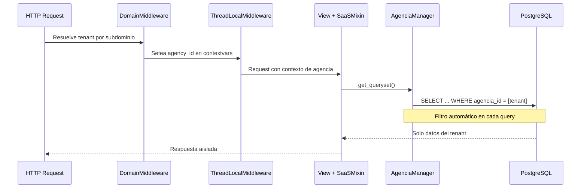
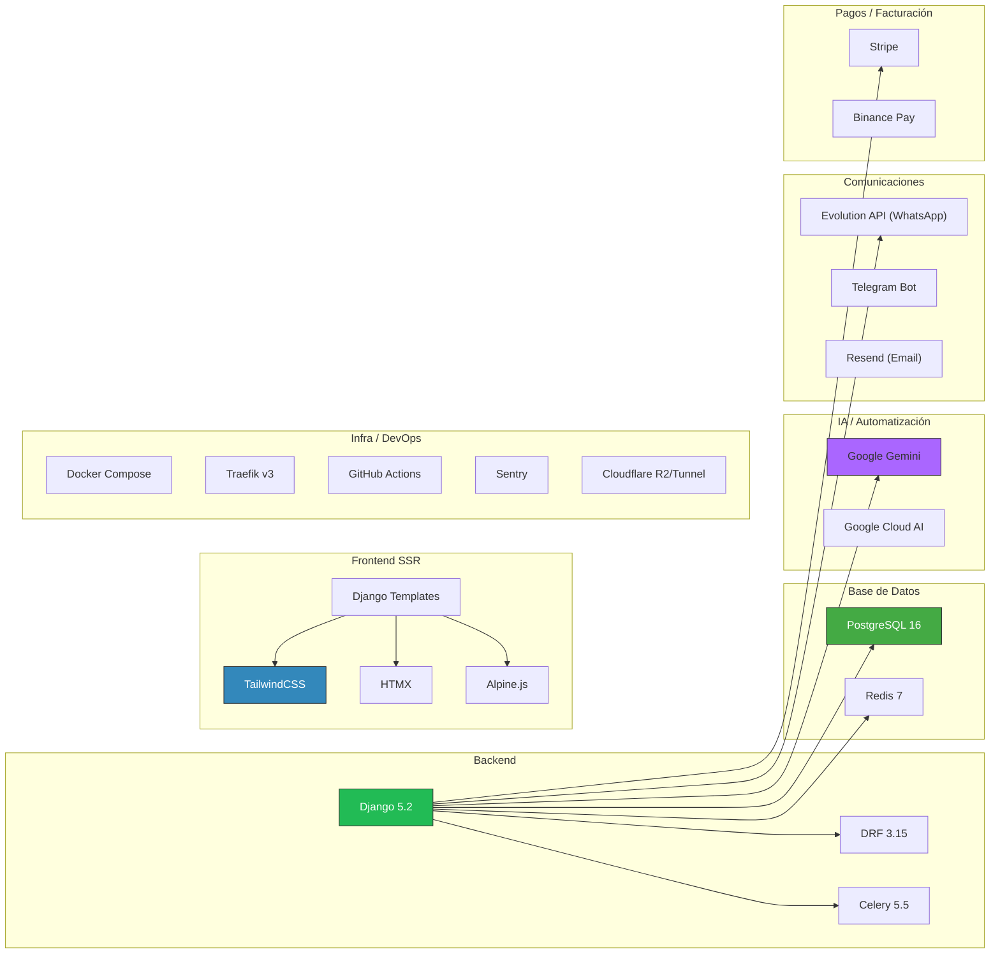
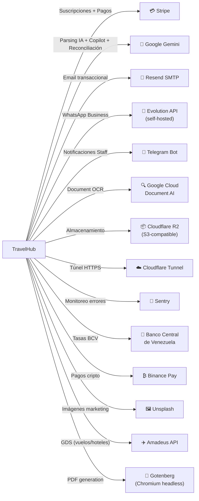
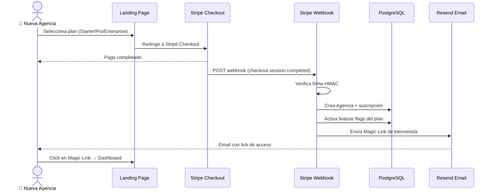

# TravelHub - Mapa de Arquitectura

> ERP SaaS Multi-tenant B2B para Agencias de Viajes

---

## 1. Visión General del Sistema



---

## 2. Arquitectura de Infraestructura (Docker Compose)



### Tareas Programadas (Celery Beat)

| Frecuencia | Tarea |
|------------|-------|
| Cada 2 min | Procesar emails entrantes |
| Cada 15 min | Monitorear límites de deadline |
| Lun-Vie 9am/1pm | Sincronizar tasas BCV |
| Diario 9am | Revisar vencimiento pasaportes |
| Diario 10am | Revisar cumpleaños clientes |
| Diario 11am | Revisar pagos pendientes |
| Diario 3am | Backup de base de datos |

---

## 3. Arquitectura de Módulos (Aplicación Django)



### Responsabilidades por Módulo

| Módulo | Modelos Clave | Vistas Principales | Servicios |
|--------|---------------|--------------------|-----------|
| **bookings** | Venta, ItemVenta, Proveedor, TarifarioProveedor, BoletoImportado | Dashboard moderno, CRUD Ventas, Importar Boletos, Itinerarios, Hoteles | boleto_service, venta_service, voucher_service, revenue_auditor, pnr_parser |
| **finance** | Factura, FacturaConsolidada, LiquidacionProveedor, ConciliacionBoleto, LinkDePago | Facturación consolidada, Liquidaciones, Reconciliación, Tax Refund | Servicios de facturación, reconciliación y liquidación |
| **crm** | Cliente, Pasajero, PasaporteEscaneado, OportunidadViaje | Pipeline Kanban, Ficha cliente, Escaneo pasaporte | CRM bot, marketing automation |
| **contabilidad** | PlanContable, AsientoContable, DetalleAsiento, TasaCambioBCV | Libro diario, Balance, Estado de resultados | bcv_client, reportes |
| **cotizaciones** | Cotizacion, ItemCotizacion | Dashboard cotizaciones, Compartir WhatsApp | pdf_service |
| **automation** | (usa modelos de bookings/crm) | Endpoints de parsing | ticket_parser, gemini_parser, kiu_parser, 20+ parsers |

---

## 4. Modelo de Datos - Entidades Principales



---

## 5. Flujo de Datos - Procesos Clave

### 5.1 Flujo de Importación de Boletos (GDS Parsing)



### 5.2 Flujo de Facturación y Liquidación



### 5.3 Flujo Multi-Tenant (Aislamiento de Datos)



---

## 6. Stack Tecnológico



---

## 7. Estrategia de Seguridad

| Capa | Mecanismo | Implementación |
|------|-----------|----------------|
| **Autenticación** | JWT + Magic Link + Session | `simplejwt`, `core/models/magic_link.py` |
| **Anti fuerza bruta** | django-axes | 5 intentos max, 1h cooldown |
| **Autorización** | RBAC (admin/manager/vendor) | `SaaSMixin` en cada View |
| **Aislamiento tenant** | contextvars + ORM filter | `AgenciaManager`, `ThreadLocalContextMiddleware` |
| **Defensa en profundidad** | PostgreSQL RLS | Políticas por agencia_id |
| **Encriptación en reposo** | Fernet (AES-128-CBC) | `EncryptedCharField` para PII |
| **Auditoría inmutable** | Cadena criptográfica SHA-256 | `AuditLog` con `previous_hash` |
| **CSP + XSS** | Nonces rotativos + bleach sanitizer | `SecurityHeadersMiddleware` |
| **Rate Limiting** | Por IP, por tenant, por endpoint | DRF throttling + middleware |
| **Validación SSRF** | Proxy validation | `evolution_proxy_views.py` |
| **Webhooks idempotentes** | Idempotency keys | Stripe + Binance webhooks |
| **TOCTOU race prevention** | `select_for_update()` | Campos `localizador`, `numero_factura` |

---

## 8. Integraciones Externas



---

## 9. Flujo SaaS (Self-Service Onboarding)



---

## 10. Estructura de Directorios Simplificada

```
travelhub/
├── settings.py                 # 850 líneas - Configuración central
├── urls.py                     # Router maestro de URLs
├── celery.py                   # App Celery + routing de colas
│
├── core/                       # 🏗️ KERNEL Multi-tenant
│   ├── models/                 # Agencia, AuditLog, MagicLink, AI, FeatureFlags
│   ├── views/                  # 58 archivos de vistas (dashboard, auth, billing, etc.)
│   ├── api/                    # API hotel + mixins
│   ├── services/               # Parsers, reports, agency_cache
│   ├── templates/              # 28 subdirectorios (base, dashboard, crm, finance, etc.)
│   ├── middleware*.py          # Tenant, SaaS, AI rate limit, performance, security
│   ├── serializers.py          # 869 líneas - Todos los serializers DRF
│   ├── signals*.py             # Audit, contabilidad, passport
│   └── security.py             # get_user_active_agency, IDOR protection
│
├── apps/                       # 📦 MÓDULOS DE DOMINIO
│   ├── bookings/               # 🎫 Ventas, itinerarios, vouchers, GDS
│   │   ├── models/             # Venta, ItemVenta, Proveedor, Tarifario, Boletos
│   │   ├── views/              # Dashboard, ventas, boletos, itinerarios, hoteles
│   │   ├── services/           # boleto, venta, voucher, revenue_auditor, pnr_parser
│   │   ├── urls.py             # 173 líneas - Todas las rutas
│   │   └── tasks.py            # Tareas Celery de bookings
│   │
│   ├── finance/                # 💰 Facturación, liquidaciones, conciliación
│   │   ├── models/             # Factura, FacturaConsolidada, Liquidacion, Reconciliacion
│   │   ├── views/              # Invoices, settlements, tax refund
│   │   ├── services/           # Lógica financiera
│   │   └── tasks_*.py          # Tasks: reconciliation, settlements, fiscal, tax_refund
│   │
│   ├── crm/                    # 👥 Clientes, pasajeros, oportunidades
│   ├── contabilidad/           # 📊 Plan contable, asientos, tasas BCV
│   ├── cotizaciones/           # 📝 Pre-ventas y cotizaciones
│   ├── automation/             # 🤖 20+ parsers GDS, AI engine
│   │   ├── parsers/            # ticket_parser, gemini_parser, kiu_parser, adapter, etc.
│   │   └── ai/                 # AI schemas
│   ├── marketing/              # 📣 Campañas, contenido IA
│   ├── cms/                    # 📄 Artículos, guías de destino
│   ├── communications/         # 💬 WhatsApp, Telegram, Email
│   └── common/                 # 🗂️ Catálogos compartidos
│
├── docs/                       # 📚 44 archivos de documentación
├── tests/                      # 🧪 97 archivos de tests (77%+ coverage)
├── docker/                     # 🐳 Configs Evolution API instances
├── nginx/                      # 🌐 Config Nginx
├── traefik_data/               # 🔄 Config Traefik reverse proxy
├── requirements/               # 📋 base.txt + prod.txt
├── scripts/                    # 🔧 Scripts utilitarios
├── .github/workflows/          # ⚙️ CI/CD (test, lint, security, docker)
│
├── Dockerfile                  # Python 3.13-slim
├── docker-compose.yml          # 7 servicios
├── docker-compose.prod.yml     # Producción
├── Makefile                    # Build automation
├── manage.py                   # Django management
└── conftest.py                 # Pytest config
```

---

## Resumen de Complejidad

| Métrica | Valor |
|---------|-------|
| **Apps Django** | 10 (core + 9 domain) |
| **Archivos de vistas** | 58+ en core, más por módulo |
| **Modelos** | 60+ modelos de datos |
| **Serializers DRF** | 869 líneas en core, más por módulo |
| **Parsers GDS** | 20+ adapters (Sabre, Amadeus, KIU, Copa, etc.) |
| **Tareas Celery** | 15+ archivos de tasks |
| **Tests** | 97 archivos, 77%+ coverage |
| **Servicios Docker** | 7 (traefik, db, redis, web, nginx, gotenberg, celery) |
| **Integraciones externas** | 12 APIs/servicios |
| **Documentación** | 44 archivos en docs/ |
| **Colas Celery** | 4 (default, ia_fast, ia_heavy, notifications) |