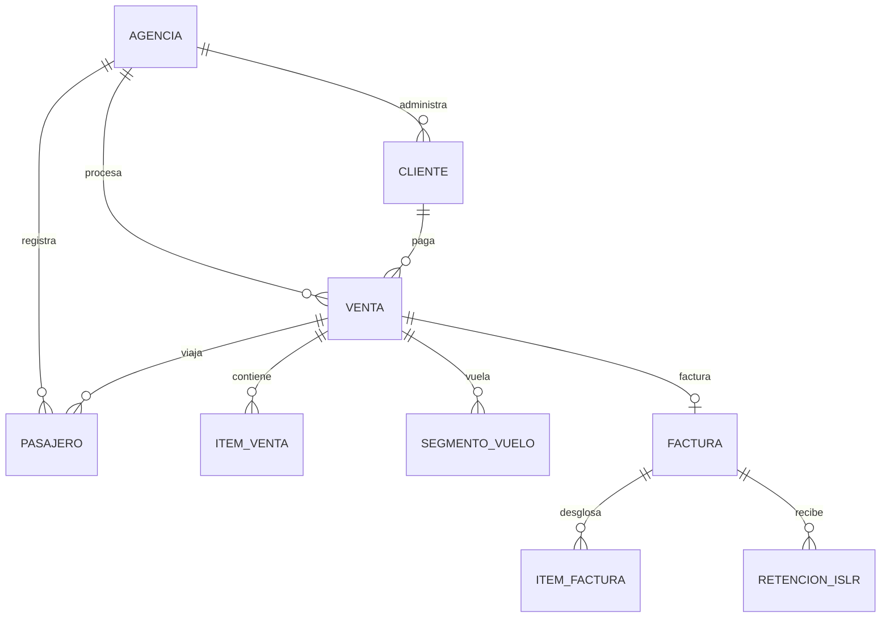

# TRAVELHUB: PLAN MAESTRO DE ESPECIFICACIÓN TÉCNICA Y RECONSTRUCCIÓN (AI-READABLE)

Este documento es una especificación técnica de extremo a extremo de **TravelHub**, una plataforma SaaS Multi-Tenant que integra CRM, ERP y CMS diseñada para agencias de viajes en Latinoamérica, con una especialización profunda en el marco legal y tributario de Venezuela (normativas del SENIAT, doble facturación, multimoneda y contabilidad VEN-NIF).

Está diseñado como una guía autocontenida y descriptiva para que un modelo de lenguaje de Inteligencia Artificial (LLM) sin acceso directo al disco duro ni a internet pueda entender y reproducir la arquitectura y lógica del proyecto con precisión de producción.

---

## 📋 TABLA DE CONTENIDOS

1. [Arquitectura del Sistema y Modularidad](#1-arquitectura-del-sistema-y-modularidad)
2. [SaaS Multi-Tenancy y Límites de Suscripción](#2-saas-multi-tenancy-y-límites-de-suscripción)
3. [Modelos de Datos y Esquemas de Base de Datos (ERD)](#3-modelos-de-datos-y-esquemas-de-base-de-datos-erd)
4. [Motor de Parseo Multi-GDS Automático (Automation)](#4-motor-de-parseo-multi-gds-automático-automation)
5. [Lógica Fiscal Venezolana y Doble Facturación](#5-lógica-fiscal-venezolana-y-doble-facturación)
6. [Motor Resiliente de Tasa de Cambio (BCV)](#6-motor-resiliente-de-tasa-de-cambio-bcv)
7. [Doble Entrada Contable (USD/BSD - VEN-NIF)](#7-doble-entrada-contable-usdbsd---ven-nif)
8. [Consolidación y Reconciliación de Reportes de Proveedores](#8-consolidación-y-reconciliación-de-reportes-de-proveedores)
9. [Integraciones de APIs y Flujos Externos](#9-integraciones-de-apis-y-flujos-externos)
10. [Motor de Vouchers y Generación de PDFs Unificados](#10-motor-de-vouchers-y-generación-de-pdfs-unificados)
11. [Configuración de Infraestructura y Entorno (Django Settings)](#11-configuración-de-infraestructura-y-entorno-django-settings)
12. [Motor Creativo de IA & Generación de Contenido CMS](#12-motor-creativo-de-ia--generación-de-contenido-cms)
13. [Asistente Virtual IA (Linkeo) y RAG Estático](#13-asistente-virtual-ia-linkeo-y-rag-estático)
14. [Estructura de Navegación del Panel de Control (Django Unfold)](#14-estructura-de-navegación-del-panel-de-control-django-unfold)
15. [Motor de Itinerarios Dinámicos (Web-App Efímera)](#15-motor-de-itinerarios-dinámicos-web-app-efímera)
16. [Módulo de Autoprovisionamiento SaaS (Tenant Onboarding)](#16-módulo-de-autoprovisionamiento-saas-tenant-onboarding)
17. [Infraestructura y Despliegue en VPS (Traefik y Docker)](#17-infraestructura-y-despliegue-en-vps-traefik-y-docker)
18. [Observabilidad, Monitoreo y Logging (Sentry y Structlog)](#18-observabilidad-monitoreo-y-logging-sentry-y-structlog)
19. [Guía de Pruebas de Reconstrucción (Test Suite - pytest)](#19-guía-de-pruebas-de-reconstrucción-test-suite---pytest)

---

## 1. Arquitectura del Sistema y Modularidad

### 🏗️ Estilo Arquitectónico: Monolito Modular
TravelHub está construido bajo un enfoque de **Monolito Modular** utilizando **Django 5.2.6**. Esto significa que todas las aplicaciones comparten la misma base de datos física, pero están estructuradas de forma que la lógica de negocio esté estrictamente delimitada.

#### Capa de Presentación (Frontend)
- Utiliza **SSR (Server-Side Rendering)** con plantillas Jinja2 / Django Templates.
- Se apoya en **HTMX** para interactividad parcial "Over-the-wire" (recarga de fragmentos HTML sin recargar la página).
- Reactividad en el cliente mediante **Alpine.js** (ligero, ~6KB) para modales, dropdowns y tabs dinámicos.
- Estilos con **Tailwind CSS**, implementando una estética oscura ("glassmorphism") de alta calidad visual.

#### Capa de Aplicación (Backend)
- **Django 5.2.6** y **Django Rest Framework (DRF)** para APIs consumidas por interfaces internas.
- **Celery + Redis** para el procesamiento de colas asíncronas (lectura de buzones IMAP, parseo pesado de archivos PDF/EML, envío de mensajes y webhooks).

#### Capa de Datos (Data Layer)
- **PostgreSQL 15+** como motor relacional de persistencia de transacciones.
- **Redis** como caché de queries repetitivos y almacenamiento de sesiones temporales.

---

### 🧱 Reglas de Dependencia y Estructura de Directorios

Para evitar dependencias circulares (un problema clásico de Django al dividir en múltiples aplicaciones), se ha impuesto una regla estricta:
1. **Core (`/core/`)**: Contiene los modelos base, utilidades de almacenamiento, autenticación global, middlewares globales, esquemas de IA y el motor central del parser. **Core no puede importar nada de la carpeta `/apps/`**.
2. **Apps (`/apps/`)**: Contiene los módulos funcionales (`crm`, `finance`, `bookings`, `contabilidad`, etc.). Las apps heredan y extienden de `core`.
3. **Lazy Loading**: En las relaciones de ForeignKey de base de datos, siempre se hace referencia a los modelos usando strings (ej: `'bookings.Venta'` o `'crm.Cliente'`), permitiendo a Django resolver los bindings en la inicialización sin importar módulos prematuramente.

---

## 2. SaaS Multi-Tenancy y Límites de Suscripción

### 🏢 El Tenant Principal: `Agencia`
TravelHub es un software multi-inquilino (*multi-tenant*) a nivel de software. El aislamiento de datos se logra mediante la inclusión de un ForeignKey al modelo `Agencia` en todas las tablas transaccionales y de configuración.

Cada usuario del sistema está asignado a un perfil que pertenece a una única `Agencia`. Todos los queries del ORM se filtran automáticamente a través de managers customizados para asegurar que una agencia nunca pueda ver o modificar datos de otra.

```python
# core/models/base.py
class AgenciaMixin(models.Model):
    agencia = models.ForeignKey('core.Agencia', on_delete=models.CASCADE, related_name="%(class)s_asociados")

    class Meta:
        abstract = True
```

### 💳 Planes de Suscripción y Control de Límites

El control de los recursos y la monetización del SaaS se gestionan mediante **Stripe** y se validan en tiempo de ejecución a través de `SaaSLimitMiddleware`.

| Plan | Límite de Usuarios | Límite de Ventas / Mes | Período de Prueba (Trial) |
| :--- | :--- | :--- | :--- |
| **FREE** | 1 Usuario | 50 Transacciones | 30 días |
| **BASIC** | 3 Usuarios | 200 Transacciones | No aplica |
| **PRO** | 10 Usuarios | 1,000 Transacciones | No aplica |
| **ENTERPRISE**| Ilimitado | Ilimitado | No aplica |

#### 🛡️ Mecanismo de Bloqueo: `SaaSLimitMiddleware`
Este middleware intercepta cada request HTTP de escritura (POST, PUT, PATCH) dirigido a endpoints críticos (ej: `/api/ventas/` o `/api/boletos/upload/`).
1. Recupera el plan activo de la `Agencia` desde el modelo `SuscripcionStripe`.
2. Cuenta el número de registros creados en el mes calendario en curso para la agencia correspondiente.
3. Si el total supera el límite del plan asignado, el middleware aborta la petición y retorna un código HTTP `402 Payment Required` con una respuesta en formato JSON detallando el límite excedido.

---

## 3. Modelos de Datos y Esquemas de Base de Datos (ERD)

A continuación se detallan los modelos críticos, campos, relaciones y restricciones necesarias para reconstruir la estructura de base de datos de TravelHub.



### A. Agencia (`core.models.Agencia`)
Almacena la información de cada inquilino de la plataforma.
- `id_agencia` (AutoField, PK)
- `nombre` (CharField, max_length=150)
- `rif` (CharField, max_length=20, unique=True) — Identificación fiscal de la agencia.
- `direccion` (TextField)
- `es_sujeto_pasivo_especial` (BooleanField, default=False) — Si es agente de percepción de IVA/IGTF ante el SENIAT.
- `esta_inscrita_rtn` (BooleanField, default=False) — Registro Turístico Nacional obligatorio en Venezuela.
- `stripe_customer_id` (CharField, max_length=100, null=True)
- `stripe_subscription_id` (CharField, max_length=100, null=True)
- `plan_activo` (CharField, choices=[('FREE', 'Free'), ('BASIC', 'Basic'), ('PRO', 'Pro'), ('ENT', 'Enterprise')], default='FREE')

### B. Cliente (`apps.crm.models.Cliente`)
El pagador de los servicios turísticos (puede ser una persona natural o una corporación).
- `id_cliente` (AutoField, PK)
- `razon_social_o_nombre` (CharField, max_length=200)
- `tipo_documento` (CharField, choices=[('V', 'Cédula Venezolana'), ('E', 'Cédula Extranjera'), ('J', 'Rif Jurídico'), ('P', 'Pasaporte')])
- `numero_documento` (CharField, max_length=50, unique=True)
- `direccion_linea1` (CharField, max_length=255)
- `telefono` (CharField, max_length=50)
- `puntos_fidelidad` (IntegerField, default=0)
- `es_cliente_frecuente` (BooleanField, default=False)

### C. Pasajero (`apps.crm.models.Pasajero`)
El viajero físico. Almacena metadatos críticos para emisión aérea y alertas médicas.
- `id_pasajero` (AutoField, PK)
- `nombres` (CharField, max_length=100)
- `apellidos` (CharField, max_length=100)
- `numero_pasaporte` (CharField, max_length=50, unique=True)
- `fecha_vencimiento_pasaporte` (DateField)
- `alergias_alimentarias` (TextField, blank=True)
- `vacuna_fiebre_amarilla` (BooleanField, default=False) — Alerta obligatoria de visualización al registrar itinerarios hacia ciertos destinos (ej: Brasil, África).

### D. Venta (`apps.bookings.models.Venta`)
La orden de venta maestra del ERP. Funciona como el nodo principal de cálculo financiero.
- `id_venta` (AutoField, PK)
- `localizador` (CharField, max_length=20) — PNR único de la reserva.
- `cliente` (ForeignKey to `Cliente`, PROTECT)
- `pasajeros` (ManyToManyField to `Pasajero`)
- `moneda` (ForeignKey to `Moneda`, PROTECT)
- `tasa_cambio_bcv` (DecimalField, max_digits=12, decimal_places=4) — Tasa de cambio oficial del día de emisión.
- `subtotal` (DecimalField, max_digits=12, decimal_places=2, default=0)
- `impuestos` (DecimalField, max_digits=12, decimal_places=2, default=0)
- `total_venta` (DecimalField, max_digits=12, decimal_places=2, default=0) — Suma automática de `subtotal + impuestos`.
- `monto_pagado` (DecimalField, max_digits=12, decimal_places=2, default=0)
- `saldo_pendiente` (DecimalField, max_digits=12, decimal_places=2) — Calculado como `total_venta - monto_pagado`.
- `estado` (CharField, choices=[('PEN', 'Pendiente'), ('PAR', 'Parcial'), ('PAG', 'Pagado'), ('CAN', 'Cancelado')], default='PEN')

### E. ItemVenta (`apps.bookings.models.ItemVenta`)
Línea individual de servicio asociada a una venta.
- `id_item_venta` (AutoField, PK)
- `venta` (ForeignKey to `Venta`, CASCADE)
- `producto_servicio` (ForeignKey to `ProductoServicio`, PROTECT)
- `cantidad` (PositiveIntegerField, default=1)
- `precio_unitario_venta` (DecimalField, max_digits=12, decimal_places=2)
- `costo_unitario_referencial` (DecimalField, max_digits=12, decimal_places=2)
- `impuestos_item_venta` (DecimalField, max_digits=12, decimal_places=2)
- `costo_neto_proveedor` (DecimalField, max_digits=12, decimal_places=2) — Costo neto sin comisión.
- `comision_agencia_monto` (DecimalField, max_digits=12, decimal_places=2)
- `fee_agencia_interno` (DecimalField, max_digits=12, decimal_places=2)
- `tipo_item` (CharField, choices=[('AIR', 'Aéreo'), ('HTL', 'Hotel'), ('CAR', 'Vehículo'), ('TRN', 'Traslado')])

### F. SegmentoVuelo (`apps.bookings.models.SegmentoVuelo`)
Detalle físico de los vuelos incluidos en un item de tipo aéreo (`AIR`).
- `id_segmento_vuelo` (AutoField, PK)
- `venta` (ForeignKey to `Venta`, CASCADE)
- `origen` (CharField, max_length=100) — Ciudad o IATA de salida.
- `destino` (CharField, max_length=100) — Ciudad o IATA de llegada.
- `aerolinea` (CharField, max_length=80)
- `numero_vuelo` (CharField, max_length=20)
- `fecha_salida` (DateTimeField)
- `fecha_llegada` (DateTimeField)
- `clase_reserva` (CharField, max_length=5)

### G. Factura / FacturaConsolidada (`apps.finance.models.Factura`)
Representación física de una factura fiscal emitida bajo regulaciones del SENIAT.
- `id_factura` (AutoField, PK)
- `numero_factura` (CharField, max_length=50, unique=True)
- `numero_control` (CharField, max_length=50) — Número de control físico impreso/digital.
- `venta_asociada` (ForeignKey to `Venta`, SET_NULL)
- `cliente` (ForeignKey to `Cliente`, PROTECT)
- `fecha_emision` (DateField, default=now)
- `tipo_operacion` (CharField, choices=[('VENTA_PROPIA', 'Venta Propia'), ('INTERMEDIACION', 'Intermediación')])
- `tasa_cambio_bcv` (DecimalField, max_digits=12, decimal_places=4)
- `subtotal_base_gravada` (DecimalField, max_digits=12, decimal_places=2) — Alícuota general (16%).
- `subtotal_exento` (DecimalField, max_digits=12, decimal_places=2) — Boletos nacionales, etc.
- `subtotal_exportacion` (DecimalField, max_digits=12, decimal_places=2) — Alícuota 0% para extranjeros.
- `monto_iva_16` (DecimalField, max_digits=12, decimal_places=2)
- `monto_igtf` (DecimalField, max_digits=12, decimal_places=2) — 3% sobre el pago correspondiente si se efectúa en divisas.
- `monto_total` (DecimalField, max_digits=12, decimal_places=2)
- `monto_total_bs` (DecimalField, max_digits=15, decimal_places=2) — Monto equivalente en Bolívares según la tasa BCV (requerido por ley).

### H. AlojamientoReserva (`apps.bookings.models.AlojamientoReserva`)
Representa la reserva de estadía de hotel asociada a un ítem de venta.
- `id_alojamiento_reserva` (AutoField, PK)
- `venta` (ForeignKey to `Venta`, CASCADE, nullable)
- `item_venta` (ForeignKey to `ItemVenta`, CASCADE, nullable)
- `nombre_establecimiento` (CharField, max_length=150)
- `check_in` (DateField, nullable)
- `check_out` (DateField, nullable)
- `regimen_alimentacion` (CharField, max_length=30, nullable) — Ej: Desayuno, Media Pensión, Todo Incluido.
- `habitaciones` (PositiveSmallIntegerField, default=1)
- `ciudad` (ForeignKey to `Ciudad`, PROTECT, nullable)
- `proveedor` (ForeignKey to `Proveedor`, SET_NULL, nullable)
- `nombre_pasajero` (CharField, max_length=255)
- `localizador_proveedor` (CharField, max_length=100)
- `notas` (TextField, nullable)

### I. AlquilerAutoReserva (`apps.bookings.models.AlquilerAutoReserva`)
Reserva de alquiler de vehículo.
- `id_alquiler_auto` (AutoField, PK)
- `venta` (ForeignKey to `Venta`, CASCADE, nullable)
- `item_venta` (ForeignKey to `ItemVenta`, CASCADE, nullable)
- `proveedor` (ForeignKey to `Proveedor`, SET_NULL, nullable)
- `ciudad_retiro` (ForeignKey to `Ciudad`, SET_NULL, nullable)
- `ciudad_devolucion` (ForeignKey to `Ciudad`, SET_NULL, nullable)
- `fecha_hora_retiro` (DateTimeField, nullable)
- `fecha_hora_devolucion` (DateTimeField, nullable)
- `categoria_auto` (CharField, max_length=50, nullable)
- `compania_rentadora` (CharField, max_length=100, nullable)
- `numero_confirmacion` (CharField, max_length=100, nullable)
- `nombre_conductor` (CharField, max_length=255)
- `incluye_seguro` (BooleanField, default=False)
- `notas` (TextField, nullable)
- `costo_neto` (DecimalField, max_digits=12, decimal_places=2, nullable)
- `precio_venta` (DecimalField, max_digits=12, decimal_places=2, nullable)

### J. ServicioAdicionalDetalle (`apps.bookings.models.ServicioAdicionalDetalle`)
Servicios genéricos del ERP (Seguros médicos, Tarjetas SIM, Pases VIP a Lounges, Fast Track).
- `id_servicio_adicional` (AutoField, PK)
- `venta` (ForeignKey to `Venta`, CASCADE, nullable)
- `item_venta` (ForeignKey to `ItemVenta`, CASCADE, nullable)
- `proveedor` (ForeignKey to `Proveedor`, SET_NULL, nullable)
- `tipo_servicio` (CharField, choices=[('SEG', 'Seguro'), ('SIM', 'SIM / E-SIM'), ('AST', 'Asistencia'), ('LNG', 'Lounge'), ('FST', 'Fast Track'), ('OTR', 'Otro')], default='OTR')
- `descripcion` (CharField, max_length=255, nullable)
- `codigo_referencia` (CharField, max_length=100, nullable)
- `fecha_inicio` (DateField, nullable)
- `fecha_fin` (DateField, nullable)
- `nombre_pasajero` (CharField, max_length=150, nullable)
- `notas` (TextField, nullable)
- `costo_neto` (DecimalField, max_digits=12, decimal_places=2, nullable)
- `precio_venta` (DecimalField, max_digits=12, decimal_places=2, nullable)

### K. TrasladoServicio (`apps.bookings.models.TrasladoServicio`)
Reservas de transportación terrestre (aeropuerto-hotel, etc.).
- `id_traslado_servicio` (AutoField, PK)
- `venta` (ForeignKey to `Venta`, CASCADE, nullable)
- `item_venta` (ForeignKey to `ItemVenta`, CASCADE, nullable)
- `tipo_traslado` (CharField, choices=[('ARR', 'Arribo / Llegada'), ('DEP', 'Salida'), ('INT', 'Interno')], default='ARR')
- `origen` (CharField, max_length=150, nullable)
- `destino` (CharField, max_length=150, nullable)
- `fecha_hora` (DateTimeField, nullable)
- `pasajeros` (PositiveSmallIntegerField, default=1)
- `proveedor` (ForeignKey to `Proveedor`, SET_NULL, nullable)
- `notas` (TextField, nullable)

### L. ActividadServicio (`apps.bookings.models.ActividadServicio`)
Excursiones, tours y actividades en destino.
- `id_actividad_servicio` (AutoField, PK)
- `venta` (ForeignKey to `Venta`, CASCADE, nullable)
- `item_venta` (ForeignKey to `ItemVenta`, CASCADE, nullable)
- `nombre` (CharField, max_length=150)
- `fecha` (DateField, nullable)
- `duracion_horas` (DecimalField, max_digits=5, decimal_places=2, nullable)
- `incluye` (TextField, nullable)
- `no_incluye` (TextField, nullable)
- `proveedor` (ForeignKey to `Proveedor`, SET_NULL, nullable)
- `nombre_pasajero` (CharField, max_length=255)
- `localizador_proveedor` (CharField, max_length=100)
- `notas` (TextField, nullable)

---

## 4. Motor de Parseo Multi-GDS Automático (Automation)

TravelHub cuenta con un motor capaz de procesar textos o PDFs de boletos aéreos de los principales GDS (Global Distribution Systems) y aerolíneas, mapeando el contenido a los modelos relacionales de forma atómica.

```
                  ┌──────────────────────┐
                  │ Archivo/Texto Boleto │
                  └──────────┬───────────┘
                             │
                  ┌──────────▼───────────┐
                  │  Detection Heuristic │
                  └──────────┬───────────┘
                             │
            ┌────────────────┼────────────────┐
            │                │                │
       ┌────▼────┐      ┌────▼────┐      ┌────▼────┐
       │   KIU   │      │  Sabre  │      │ Amadeus │
       └────┬────┘      └────┬────┘      └────┬────┘
            │                │                │
     BeautifulSoup /    Gemini API +       Regex
      Regex Heuristics    Regex Fallback   Engine
            │                │                │
            └────────────────┼────────────────┘
                             │
                  ┌──────────▼───────────┐
                  │  Pydantic Validation │
                  └──────────┬───────────┘
                             │
                  ┌──────────▼───────────┐
                  │   Database Builder   │
                  └──────────────────────┘
```

### 🔍 Heurística de Autodetección de GDS
El enrutador determina qué motor de parseo utilizar analizando la presencia de subcadenas específicas en el texto crudo del boleto (normalizado a mayúsculas y sin espacios consecutivos):

- **KIU**: Presencia de `"KIUSYS.COM"`, `"PASSENGER ITINERARY RECEIPT"` o `"TICKET ELECTRONICO"`.
- **SABRE**: Presencia de `"SABRE"`, `"ETICKET RECEIPT"`, `"RECORD LOCATOR"`, `"RESERVATION CODE"` o `"RECIBO DE BOLETO"`.
- **AMADEUS**: Presencia de `"AMADEUS"`, `"CHECKMYTRIP"`, `"ELECTRONIC TICKET RECEIPT"` o `"BOOKING REF:"`.
- **COPA_SPRK**: Presencia de `"ACCELYA.COM"`, `"FARELOGIX"` o `"SPRK"` en los headers de correo o metadatos del EML.
- **TURKISH (TK Connect)**: Presencia de `"TURKISH AIRLINES"` y boletos con prefijo `"235-"`.
- **WINGO**: Presencia de `"WINGO"`, boletos sin números de boleto tradicionales (Low-Cost) y códigos internos específicos.

---

### 🛡️ Los 7 Parsers Específicos

#### 1. Parser de KIU (`kiu_parser.py`)
- **Estrategia**: Prioriza la estructura HTML si el archivo de entrada es un correo electrónico o exportación web. Usa BeautifulSoup (`BeautifulSoup(html, 'html.parser')`) para extraer los datos de las tablas de tarifas e itinerario.
- **Fallback**: Si la entrada es texto plano de un PDF escaneado, aplica expresiones regulares secuenciales para buscar impuestos (patrón `(\d+\.\d+)YN` o `YN\s*(\d+\.\d+)`) y segmentos de vuelo.
- **Soporte VES**: Si detecta la moneda local (`VES`, `Bs`, o `Bs.S`), activa automáticamente el flag `usar_template_bolivares` para renderizar el PDF final con el formato monetario venezolano.

#### 2. Parser de SABRE (`sabre_parser.py`)
- **Estrategia Híbrida**: Sabre genera boletos en formatos PDF de alta variabilidad espacial. El parser realiza un enfoque híbrido:
  1. **Tier 1 (IA - Gemini)**: Envía el texto crudo a la API de Gemini utilizando la técnica de **Structured Outputs** con el esquema Pydantic `ResultadoParseoSchema`.
  2. **Tier 2 (Fallback Regex)**: Si la API de Gemini falla, no tiene internet, o da timeout, se activa el motor determinístico de expresiones regulares.
- **División de Itinerarios**: El motor regex divide el bloque de vuelos usando expresiones regulares que detectan múltiples segmentos independientes (ej. `BOG-MAD` seguido de `MAD-BOG` semanas después), evitando capturar únicamente el primer vuelo.

#### 3. Parser de AMADEUS (`amadeus_parser.py`)
- Diseñado para leer PDFs de Amadeus o de la app "CheckMyTrip".
- Extrae la clave de reserva de 6 caracteres alfanuméricos buscando el patrón `BOOKING REF: ([A-Z0-9]{6})`.
- Lee las tablas de itinerario buscando las palabras claves de parada (`ARRIVAL`, `DEPARTURE`, `OPERATED BY`).

#### 4. Parser de COPA SPRK (`copa_parser.py`)
- **Regla de Oro**: Este parser **exige** que la entrada sea un archivo `.eml` (email crudo) en lugar del PDF impreso por navegador. La impresión a PDF de los boletos de Copa suele corromper las fuentes vectoriales, convirtiendo caracteres en elementos ilegibles (bloques de texto del tipo `(cid:22)`).
- El parser procesa el payload decodificado del MIME multipart, aplicando expresiones regulares de extracción directamente sobre el HTML nativo del correo de confirmación de Copa Airlines.

#### 5. Parser de Turkish Airlines (TK Connect)
- Especializado en el formato del portal directo de Turkish Airlines.
- Identifica el número de boleto que inicia obligatoriamente con el código de aerolínea IATA de Turkish: `235`.
- Procesa formatos de fecha en inglés/turco (ej. `22MAY` o `22 MAYIS`).

#### 6. Parser de Wingo (`wingo_parser.py`)
- Formato de aerolínea de bajo costo (Low-Cost).
- A diferencia de los GDS, Wingo no emite números de boleto tradicionales de 13 dígitos del estándar IATA. El parser mapea el código de confirmación interno como localizador y deja el campo de número de boleto como `null` en base de datos sin disparar errores de integridad fiscal.

#### 7. Parser de Travelport (`travelport_parser.py`)
- Soporta formatos Galileo y Worldspan.
- Busca marcas como `1G` (Galileo) o `1P` (Worldspan).

---

### 🛡️ Esquema de Validación de Salida (Pydantic)
Todos los parsers deben normalizar su salida y validarla contra los siguientes esquemas de Pydantic antes de procesarse en la base de datos de TravelHub:

```python
# core/models/ai_schemas.py

class TramoVueloSchema(BaseModel):
    aerolinea: str
    numero_vuelo: str | None = None
    origen: str
    codigo_iata_origen: str | None = None
    fecha_salida: str  # Formato DDMMMAA (ej: 29MAR26)
    hora_salida: str   # Formato 24h HH:MM (ej: 14:15)
    destino: str
    codigo_iata_destino: str | None = None
    hora_llegada: str  # Formato 24h HH:MM
    fecha_llegada: str | None = None
    cabina: str | None = None
    clase: str | None = None
    localizador_aerolinea: str | None = None
    equipaje: str | None = None

class BoletoAereoSchema(BaseModel):
    nombre_pasajero: str  # APELLIDO/NOMBRE
    codigo_identificacion: str | None = None  # Cédula o RIF
    solo_nombre_pasajero: str
    numero_boleto: str | None = None  # 13 dígitos
    fecha_emision: str | None = None
    codigo_reserva: str  # PNR de 6 caracteres
    codigo_reserva_aerolinea: str | None = None
    itinerario: list[TramoVueloSchema]
    tarifa: float
    impuestos: float
    total: float
    moneda: str = "USD"
    es_remision: bool = False
    source_system: str
```

#### Reglas de Validación de Negocio Incorporadas (Model Validators):
- **Consistencia Matemática**: El validador de Pydantic ejecuta de forma obligatoria `tarifa + impuestos == total`. Si existe un desfase decimal menor a 0.05 USD (debido a redondeos de tasa en el boleto), ajusta el total automáticamente. Si la diferencia es mayor, marca el estado del parser como error.
- **Extracción de Nombres**: Se implementa un filtro regex que limpia campos adicionales (ej. capturas que arrastran etiquetas como `FOID`, `RIF`, `DNI`, `C.I`, `V-`, `TEL`, `TKTN`), previniendo nombres corruptos en base de datos.
- **Monedas**: Normaliza monedas informales a su equivalente ISO 4217 (ej. `Bs.S` o `Bs` -> `VES`, `Dolares` -> `USD`). Si la moneda no se reconoce, aplica un fallback por defecto a `USD`.

---

## 5. Lógica Fiscal Venezolana y Doble Facturación

Venezuela aplica reglas tributarias muy específicas a la intermediación de pasajes de transporte terrestre y aéreo (según la Ley de IVA y providencias del SENIAT). Para cumplir de forma simultánea con el estándar internacional de contabilidad (NIIF/VEN-NIF) y la ley fiscal local, TravelHub implementa el **Servicio de Doble Facturación**.

### 💼 Concepto de Intermediación (Art. 10 Ley de IVA)
Una agencia de viajes no "vende" el boleto de avión; intermedia entre el cliente y la aerolínea. Por lo tanto:
1. El costo neto del boleto pertenece a la aerolínea (tercero). Está **Exento** de IVA en la factura de la agencia.
2. La agencia de viajes cobra un **Fee de Emisión** o **Comisión** (Servicio Propio). Este monto es el ingreso real de la agencia y es lo que debe pagar IVA general (16%).

---

### 🔄 Flujo de Generación de Doble Factura
Al procesar la venta de un boleto aéreo, `DobleFacturacionService` genera automáticamente **dos facturas separadas** bajo una misma venta:

#### 1. Factura por Cuenta de Terceros (F1)
- **Concepto**: Costo del boleto aéreo.
- **Emisor**: Datos de la Agencia de Viajes (snapshot actual).
- **Cliente**: Datos del Cliente de la venta.
- **Tercero Relacionado (Campos SENIAT)**: `tercero_rif` (RIF de la Aerolínea) y `tercero_razon_social`.
- **Tratamiento Fiscal**: Exento de IVA (según Art. 10 de la Ley de IVA en Venezuela).
- **ISLR**: No aplica retención de ISLR, ya que el cobro es para un tercero exento.

#### 2. Factura por Servicios Propios (F2)
- **Concepto**: Fee de Emisión y Comisión de Agencia.
- **Emisor**: Datos de la Agencia de Viajes.
- **Cliente**: Datos del Cliente.
- **Bifurcación Fiscal según Ruta**:
  - **Ruta Nacional**: 100% del fee de emisión es base gravable al **16% de IVA**.
  - **Ruta Internacional**: El IVA en viajes internacionales se calcula sobre una base imponible del 20% (el 80% restante de la comisión se considera legalmente no sujeto o exento de IVA).
- **Fórmula de cálculo para Ruta Internacional**:
  $$\text{Base Gravada} = \text{Fee de Emisión} \times 0.20$$
  $$\text{Base No Sujeta (Exenta)} = \text{Fee de Emisión} \times 0.80$$
  $$\text{IVA 16\%} = \text{Base Gravada} \times 0.16$$

```python
# Lógica implementada en apps/common/services/doble_facturacion.py
es_nacional = datos_tercero.get('es_nacional', True)

if es_nacional:
    base_gravada = fee_servicio
    base_no_sujeta = Decimal('0.00')
else:
    base_gravada = fee_servicio * Decimal('0.20')
    base_no_sujeta = fee_servicio * Decimal('0.80')

iva_16 = base_gravada * Decimal('0.16')
```

---

### 💰 Impuesto a las Grandes Transacciones Financieras (IGTF)
De acuerdo a la Ley del IGTF, los pagos efectuados en moneda extranjera (divisas o criptomonedas) dentro del territorio nacional, sin mediación de cuentas bancarias internacionales de custodia, están gravados con una alícuota del **3%**.
- TravelHub calcula de forma automática este 3% en la factura consolidada si se indica que la moneda de pago es `DIVISA` nacional y la agencia está configurada como *Sujeto Pasivo Especial*.

---

### 🏛️ Retenciones de ISLR (Decreto 1.808)
Cuando el cliente es una Persona Jurídica (Sujeto Pasivo Especial) y la agencia le factura, el cliente está obligado a retener un porcentaje del Impuesto Sobre la Renta (ISLR) antes de pagar la factura de la agencia.
- **Concepto SENIAT**: Comisiones Mercantiles (Código de concepto `03-04`).
- **Porcentaje de Retención**: **5%** (aplicable a transacciones Persona Jurídica a Persona Jurídica).
- **Mapeo del Comprobante**: El sistema cuenta con el modelo `RetencionISLR` para asociar el comprobante físico emitido por el cliente a la factura original, disminuyendo automáticamente la cuenta por cobrar (CxC) de la agencia por el monto retenido.

---

## 6. Motor Resiliente de Tasa de Cambio (BCV)

Debido al control cambiario y la dualidad monetaria (USD como moneda comercial de uso común, BSD como moneda oficial de registro y presentación fiscal), el sistema necesita disponer de la tasa oficial publicada diariamente por el Banco Central de Venezuela (BCV).

Dado que los servidores del gobierno venezolano sufren caídas frecuentes o bloqueos por geolocalización, el servicio `bcv_service.py` implementa un **Cálculo Cambiario Resiliente** en tres niveles de redundancia:

```
           🚀 SOLICITUD DE TASA BCV
                     │
         ┌───────────▼───────────┐
         │ Nivel 1: pyDolar      │◄── Consulta en vivo
         └───────────┬───────────┘
                     │
             ¿Error o Caída?
                     ├── No ──► Retorna Tasa
                     └── Sí
         ┌───────────▼───────────┐
         │ Nivel 2: DolarApi     │◄── API externa espejo
         └───────────┬───────────┘
                     │
             ¿Error o Caída?
                     ├── No ──► Retorna Tasa
                     └── Sí
         ┌───────────▼───────────┐
         │ Nivel 3: Base de Datos│◄── Última tasa guardada
         └───────────┬───────────┘    (Survival Cache)
                     │
                     ├────────► Envía alerta por Telegram
                     └────────► Retorna Tasa
```

### 1. Nivel 1: pyDolarVenezuela
Consulta en vivo los datos del BCV utilizando la librería `pyDolarVenezuela` configurada con el scraper del BCV para evadir bloqueos de bots.

### 2. Nivel 2: DolarApi Espejo
Si el scraper falla, consume una API externa de contingencia (`DolarApi`) que mantiene un registro espejo actualizado de las cotizaciones oficiales del BCV.

### 3. Nivel 3: Caché de Supervivencia (Survival Cache)
Si internet falla o ambos servicios están caídos:
1. Consulta la base de datos de TravelHub (`TasaCambio`) y obtiene el último registro de tasa guardado con fecha anterior más cercana.
2. Activa una alerta inmediata dirigida al canal del administrador del sistema mediante el Bot de Telegram integrado, advirtiendo que el BCV está caído y que el ERP está operando con tasa histórica para evitar la paralización de la facturación.

---

## 7. Doble Entrada Contable (USD/BSD - VEN-NIF)

TravelHub implementa un motor contable automatizado de doble entrada. Aunque los montos de ventas y costos se calculan en dólares americanos (USD - Moneda funcional interna para proteger la contabilidad de la devaluación), el sistema genera y almacena paralelamente los equivalentes en bolívares (BSD - Moneda de presentación legal ante el SENIAT) calculados al centavo mediante la tasa BCV del día de la operación.

### 🧾 Esquema de Datos Contables

#### A. PlanContable (`apps.contabilidad.models.PlanContable`)
Define el catálogo de cuentas de la agencia.
- `id_cuenta` (AutoField, PK)
- `codigo_cuenta` (CharField, unique=True) — Ej: "1.1.02.02".
- `nombre_cuenta` (CharField)
- `tipo_cuenta` (CharField, choices=[('AC', 'Activo'), ('PA', 'Pasivo'), ('PT', 'Patrimonio'), ('IN', 'Ingreso'), ('GA', 'Gasto/Costo'), ('CO', 'Cuenta de Orden')])
- `nivel` (PositiveSmallIntegerField, default=1) — Nivel de jerarquía contable.
- `cuenta_padre` (ForeignKey to `self`, SET_NULL, nullable)
- `permite_movimientos` (BooleanField, default=True) — Si es falso, es una cuenta acumuladora.
- `naturaleza` (CharField, choices=[('D', 'Deudora'), ('H', 'Acreedora')])

#### B. AsientoContable (`apps.contabilidad.models.AsientoContable`)
Cabecera de un diario contable.
- `id_asiento` (AutoField, PK)
- `numero_asiento` (CharField, unique=True, blank=True)
- `fecha_contable` (DateField, default=now)
- `descripcion_general` (CharField)
- `tipo_asiento` (CharField, choices=[('DIA', 'Diario'), ('COM', 'Compras'), ('VEN', 'Ventas'), ('NOM', 'Nómina'), ('APE', 'Apertura'), ('CIE', 'Cierre'), ('AJU', 'Ajuste')], default='DIA')
- `referencia_documento` (CharField, nullable) — Ej: "Factura #1034".
- `estado` (CharField, choices=[('BOR', 'Borrador'), ('CON', 'Contabilizado'), ('ANU', 'Anulado')], default='BOR')
- `tasa_cambio_aplicada` (DecimalField, max_digits=18, decimal_places=8, default=1.0)
- `moneda` (ForeignKey to `Moneda`, PROTECT)
- `total_debe` (DecimalField, default=0, editable=False)
- `total_haber` (DecimalField, default=0, editable=False)

#### C. DetalleAsiento (`apps.contabilidad.models.DetalleAsiento`)
Líneas de transacción contable de doble entrada. Guarda montos en USD y BSD de forma simultánea.
- `id_detalle_asiento` (AutoField, PK)
- `asiento` (ForeignKey to `AsientoContable`, CASCADE)
- `linea` (PositiveSmallIntegerField) — Secuencia del ítem.
- `cuenta_contable` (ForeignKey to `PlanContable`, PROTECT)
- `debe` (DecimalField, default=0) — Monto en USD al Debe.
- `haber` (DecimalField, default=0) — Monto en USD al Haber.
- `debe_bsd` (DecimalField, default=0) — Monto al Debe en BSD a la tasa del día.
- `haber_bsd` (DecimalField, default=0) — Monto al Haber en BSD a la tasa del día.
- `descripcion_linea` (CharField, nullable)

#### D. LiquidacionProveedor (`apps.contabilidad.models.LiquidacionProveedor`)
Control contable de facturas y desembolsos a pagar a aerolíneas y proveedores de servicios.
- `id_liquidacion` (AutoField, PK)
- `proveedor` (ForeignKey to `Proveedor`, PROTECT)
- `venta` (ForeignKey to `Venta`, SET_NULL, nullable)
- `fecha_emision` (DateField, default=now)
- `fecha_vencimiento` (DateField, nullable)
- `monto_total` (DecimalField, default=0) — Total a pagar en USD.
- `monto_pagado` (DecimalField, default=0)
- `saldo_pendiente` (DecimalField, default=0, editable=False) — Auto-calculado.
- `estado` (CharField, choices=[('PEN', 'Pendiente'), ('PAR', 'Pagado Parcial'), ('PAG', 'Pagado'), ('ANU', 'Anulado')], default='PEN')
- `archivo_pdf` (FileField, nullable) — Comprobante PDF de liquidación generado.

---

### 🧾 Plan de Cuentas Automatizado (Mapeo de Cuentas)

| Código de Cuenta | Nombre de la Cuenta | Tipo | Rol en la Venta de Boletos |
| :--- | :--- | :--- | :--- |
| **`1.1.01.02`** | Caja General (USD) | Activo | Recibe el débito al registrarse un pago en efectivo. |
| **`1.1.01.04`** | Bancos Nacionales (USD) | Activo | Recibe el débito al conciliarse una transferencia. |
| **`1.1.02.02`** | Cuentas por Cobrar Clientes | Activo | Se debita al generar la factura (CxC del Cliente). |
| **`2.1.01.02`** | Cuentas por Pagar Proveedores | Pasivo | Se acredita por el costo neto del boleto (CxP Aerolínea). |
| **`2.1.02.01`** | IVA Débito Fiscal por Pagar | Pasivo | Se acredita con el 16% de IVA sobre comisiones/fees. |
| **`4.1.01`** | Ingresos por Comisión de Boletos | Ingreso | Se acredita con la ganancia neta de la intermediación. |
| **`7.1.01`** | Ingreso por Diferencial Cambiario | Ingreso | Se acredita si el dólar sube entre la facturación y el cobro. |
| **`7.2.01`** | Pérdida por Diferencial Cambiario | Egreso | Se debita si la tasa BCV baja entre la facturación y el cobro. |

---

### 📊 Lógica Contable de un Boleto de Intermediación (Asiento Automático)

Al facturar un boleto aéreo vendido a través de una aerolínea (ej. Laser Airlines):

1. **Se genera un Débito** a la cuenta de Activo `1.1.02.02` (Cuentas por Cobrar Clientes) por el **Total de la Venta** (Tarifa Base del boleto + Tasas exentas + Comisión de Agencia + IVA del fee).
2. **Se genera un Crédito** a la cuenta de Pasivo `2.1.01.02` (Cuentas por Pagar Proveedores) por el **Costo Neto del Boleto** (Tarifa base + Tasas - Comisión pactada).
3. **Se genera un Crédito** a la cuenta de Ingreso `4.1.01` (Ingresos por Comisión) por la **Ganancia de Intermediación (Fee/Comisión)**.
4. **Se genera un Crédito** a la cuenta de Pasivo `2.1.02.01` (IVA Débito Fiscal por Pagar) por el **Monto del IVA calculado sobre el Fee**.

#### ⚖️ Ejemplo Contable de un Boleto Internacional:
- **Costo del Boleto (Aerolínea)**: 500 USD (Exento de IVA para la agencia).
- **Fee de Servicio (Agencia)**: 50 USD.
- **Ruta**: Internacional (Aplica base gravable del 20%).
  - Base Gravada: $50 \times 0.20 = 10\text{ USD}$
  - Base Exenta/No Sujeta: $50 \times 0.80 = 40\text{ USD}$
  - IVA (16% de 10 USD): $1.60\text{ USD}$
- **Total Cobrado al Cliente**: $551.60\text{ USD}$
- **Costo a pagar a Aerolínea**: $500.00\text{ USD}$
- **Ganancia Neta (Ingreso)**: $50.00\text{ USD}$

**Registro del Asiento (en USD y Bs al tipo de cambio BCV):**
- **DEBE**: `1.1.02.02` Cuentas por Cobrar Clientes $\rightarrow 551.60\text{ USD}$
- **HABER**: `2.1.01.02` Cuentas por Pagar Proveedores (Aerolínea) $\rightarrow 500.00\text{ USD}$
- **HABER**: `4.1.01` Ingresos por Comisión de Boletos $\rightarrow 50.00\text{ USD}$
- **HABER**: `2.1.02.01` IVA Débito Fiscal por Pagar $\rightarrow 1.60\text{ USD}$

---

## 8. Consolidación y Reconciliación de Reportes de Proveedores

Las agencias de viajes reciben estados de cuenta semanales o mensuales en formatos Excel o CSV de sus consolidadores y aerolíneas de confianza (ej. CTG, My Destiny). La conciliación manual de estos listados contra el sistema administrativo es una tarea propensa a errores.

TravelHub implementa un motor inteligente de reconciliación en la aplicación `finance` (`apps/finance/services/smart_reconciliation_service.py`):

```python
# Mapeo del esquema de salida inteligente en apps/finance/models/ai_accounting_schemas.py
class MatchExitosoSchema(BaseModel):
    venta_id: int
    proveedor_item_id: str  # Número de boleto o PNR del reporte
    diferencia_monto: float
    confianza: float
    comentario: str

class BoletoHuerfanoSchema(BaseModel):
    proveedor_item_id: str
    pasajero: str
    monto: float
    causa_probable: str

class ConciliacionLoteSchema(BaseModel):
    matches: list[MatchExitosoSchema]
    huerfanos: list[BoletoHuerfanoSchema]
    alertas_fraude: list[str]
```

### 🧠 El Algoritmo de Matching Difuso
1. **Normalización**: El sistema lee el Excel del proveedor y extrae un listado plano de registros de vuelos. Limpia y estandariza los números de boleto (eliminando guiones) y los nombres de los pasajeros.
2. **Búsqueda Exacta**: Intenta cruzar los datos basándose en el campo único de 13 dígitos (`numero_boleto`).
3. **Búsqueda por IA (Gemini)**: Si los boletos en el reporte no tienen el número de boleto (o este difiere por truncamiento en algún dígito), el sistema envía los bloques no emparejados a Gemini para aplicar cruce difuso.
   - La IA analiza coincidencia fonética de nombres (ej. "Isaza Mauricio" vs "Mauricio Isaza"), fechas de viaje con rangos de tolerancia de $\pm 2$ días y coincidencias de PNRs parciales.
4. **Banderas de Alerta**:
   - **Boleto Huérfano**: Transacción reclamada por el proveedor pero que no existe en el sistema de la agencia (posible venta paralela u omisión del agente).
   - **Discrepancia de Monto**: El boleto existe, pero el costo cobrado por el proveedor difiere de la tarifa base configurada en la venta del sistema de la agencia (posible error de tarifa de emisión o cobro indebido del proveedor).

---

## 9. Integraciones de APIs y Flujos Externos

TravelHub está concebido para interactuar dinámicamente con múltiples servicios externos mediante llamadas a APIs seguras y procesamiento asíncrono de Webhooks.

```
                  ┌──────────────────────┐
                  │    Stripe Webhook    │
                  └──────────┬───────────┘
                             │
            ┌────────────────┴────────────────┐
            │                                 │
     checkout.session.completed        customer.subscription.deleted
            │                                 │
   Agencia creada / Activada         Suscripción cancelada / Bloqueo
```

### A. Stripe (SaaS Billing & Subscriptions)
- **Ruta del Webhook**: `/api/billing/webhook/` (gestionado en `apps/finance/views/billing_views.py`).
- **Eventos Críticos Procesados**:
  - `checkout.session.completed`: Disparado cuando una nueva agencia completa el flujo de pago inicial. Crea el perfil de la `Agencia` en TravelHub, inicializa el administrador predeterminado del tenant y genera la estructura básica del Plan Contable.
  - `invoice.payment_succeeded`: Registra la recepción del pago recurrente mensual del plan de suscripción de Stripe.
  - `customer.subscription.deleted` o `invoice.payment_failed`: Bloquea temporalmente el acceso de escritura de la agencia del inquilino, degradando el estado de su tenant a inactivo hasta que se regularice la situación de cobro.

---

### B. Gemini API (Lógica Aumentada por IA)
- **Ruta de Servicio**: `/core/chatbot/` o `/core/services/ticket_parser_service.py`.
- **Casos de Uso**:
  - **Reconciliador Contable**: Clasifica correos y asocia depósitos bancarios no identificados a cuentas de clientes o facturas pendientes basándose en descripciones textuales.
  - **OCR de Pasaportes y Cédulas**: Extrae los campos de imágenes de documentos de identidad subidos al CRM (utilizando la visión artificial de Gemini y devolviendo los datos estructurados en esquemas Pydantic `PasaporteOCRSchema` o `CedulaOCRSchema`).

---

### C. Notificaciones (Twilio WhatsApp & Email IMAP)
- **Monitoreo Automático de Correo (IMAP)**:
  - Tarea programada de Celery (`core.tasks.monitor_emails_task`) que se conecta cada 5 minutos a la casilla de correo configurada por la agencia (`AgenciaConfigEmail`).
  - Descarga los correos entrantes, detecta adjuntos (PDFs) o cuerpos HTML, los envía al parser unificado (`extract_data_from_text`), crea la `Venta`, genera la facturación y la guarda en la base de datos de forma automática.
- **Twilio WhatsApp**:
  - Utiliza la API de Twilio para enviar el itinerario final renderizado en PDF (`media/boletos_generados/`) y la factura fiscal directamente al número telefónico del pasajero cuando el estado de la venta pasa a `PAGADA_TOTAL`.

---

## 10. Motor de Vouchers y Generación de PDFs Unificados

Para proveer a los clientes una vista consolidada de sus viajes, TravelHub dispone de un motor en `apps/bookings/services/voucher_service.py` que compila reservas de diferentes naturalezas (Aéreos, Hoteles, Traslados, Actividades, Alquiler de Autos) y produce un único archivo PDF unificado.

### 📄 Firmas del Servicio de Generación
- **`generar_voucher_servicio(servicio_adicional)`**: Genera el voucher en PDF para un ítem de tipo `SEG` (Seguro de viaje) utilizando la plantilla `core/vouchers/voucher_seguro.html`, o un servicio genérico (`SIM`, `AST`, `LNG`, `FST`) con `core/vouchers/voucher_servicio_adicional.html`.
- **`generar_voucher_alojamiento(alojamiento)`**: Genera el voucher de estadía de hotel a partir del modelo `AlojamientoReserva`, renderizando `core/vouchers/voucher_alojamiento.html`.
- **`generar_voucher_alquiler_auto(alquiler)`**: Genera el voucher de renta de vehículo con `core/vouchers/voucher_alquiler_auto.html`.
- **`generar_voucher_traslado(traslado)`**: Genera el voucher de transportación terrestre con `core/vouchers/voucher_traslado.html`.
- **`generar_voucher_actividad(actividad)`**: Genera el voucher de tours y excursiones con `core/vouchers/voucher_actividad.html`.
- **`generar_voucher_unificado(venta_id)`**: Función principal. Obtiene todas las relaciones asociadas a una `Venta` (`alojamientos`, `alquileres_autos`, `servicios_adicionales`, `segmentos_vuelo`, `traslados`, `actividades`), selecciona la plantilla según la preferencia estética de la agencia y renderiza un único PDF consolidado.

### 🎨 Personalización de Marca de la Agencia
El motor aplica dinámicamente el estilo corporativo de cada tenant (`Agencia`):
1. **Detección del Color de Marca**: Utiliza `agencia.color_primario` para la paleta de colores del PDF.
2. **Contraste de Brillo (`is_brand_color_dark`)**: Valida si el color primario es oscuro para renderizar textos claros sobre fondos oscuros o viceversa:
   $$Y = 0.299R + 0.587G + 0.114B$$
   Si $Y < 128$, se considera color oscuro.
3. **Incrustación del Logo (`get_agencia_logo_b64`)**: Convierte la imagen del logotipo de la agencia a Base64 para que sea insertada inline en el HTML, garantizando que weasyprint/Gotenberg la procese correctamente sin requerir peticiones de red locales.
4. **Mapeo de Variaciones de Plantilla**:
   - `m1` -> `vouchers/variations/v1_golden_classic.html`
   - `m2` -> `vouchers/variations/v2_editorial.html`
   - `m3` -> `vouchers/variations/v3_executive.html`
   - `m4` -> `vouchers/variations/v4_timeline.html`
   - `m5` -> `vouchers/variations/v5_modern.html`

---

## 11. Configuración de Infraestructura y Entorno (Django Settings)

Para que el monolito modular funcione con rendimiento y seguridad de producción, TravelHub implementa configuraciones de infraestructura específicas en su backend Django (`settings.py`):

### 💾 Base de Datos Relacional y Pooling (PostgreSQL)
- **Carga Dinámica**: Usa `dj_database_url` para inicializar el objeto `DATABASES` a partir de la variable de entorno `DATABASE_URL`.
- **Integridad y Transacciones**: Forzado de transacciones atómicas automáticas por cada petición HTTP (`ATOMIC_REQUESTS = True`).
- **Connection Pooling**: Mantiene las conexiones activas durante 60 segundos (`CONN_MAX_AGE = 60`) y realiza chequeos de salud periódicos (`CONN_HEALTH_CHECKS = True`) para optimizar el rendimiento en consultas concurrentes.

### ⚡ Caching, Colas de Tareas y Sesiones (Redis)
- **Redis Cache (DB 1)**: Configura `CACHES['default']` usando `django_redis.cache.RedisCache` con un pool máximo de 50 conexiones para caching general (ej: tasas BCV, rate-limiting de APIs, circuito abierto).
- **Redis Sessions (DB 2)**: Almacena las cookies y estados de sesión del usuario en Redis (`SESSION_ENGINE = 'django.contrib.sessions.backends.cache'`) con un tiempo de expiración corto (1 hora) y guardado en cada petición.
- **Celery Broker & Backend (DB 0)**: Redis actúa como broker de mensajes y backend de resultados para tareas asíncronas (`CELERY_BROKER_URL`).
- **Fallback de Desarrollo**: Si Redis no está disponible o no se detecta su URL, se activa automáticamente `LocMemCache` para desarrollo local en memoria.

### ☁️ Estrategia de Almacenamiento Unificada (Cloudflare R2)
- **Persistencia**: TravelHub utiliza **Cloudflare R2** para almacenar todos los archivos multimedia, vouchers generados, PDFs de facturas e imágenes subidas al CRM ($0 de comisión por transferencia de salida / egress fees).
- **Controlador**: Utiliza la clase de backend `storages.backends.s3boto3.S3Boto3Storage` configurada con endpoints específicos de R2, claves de acceso del bucket y deshabilitando ACLs (ya que R2 maneja la seguridad a nivel de bucket).

### 📧 Motor de Distribución de Correos (Resend SMTP & SendGrid)
El motor de correo selecciona su canal de salida en base a prioridades:
1. **Resend (SMTP)**: Si se encuentra la variable `RESEND_API_KEY`, configura el SMTP a través de `smtp.resend.com` en el puerto 587 con TLS.
2. **SendGrid (SMTP)**: Si no hay Resend pero existe `SENDGRID_API_KEY` (distinta de la clave vacía por defecto), redirige al SMTP de `smtp.sendgrid.net` usando el usuario genérico `apikey`.
3. **Desarrollo (Consola)**: Si no se configuran credenciales de producción, los correos son redirigidos a la consola del desarrollador.

### 🛡️ Cortafuegos de Seguridad e Infraestructura Axes
- **Protección contra Fuerza Bruta (`django-axes`)**: Bloquea accesos maliciosos tras 5 intentos fallidos combinando IP y Username por un período de enfriamiento de 1 hora.
- **Padlock HSTS & SSL**: Fuerza redirecciones HTTPS y habilita cabeceras de seguridad estrictas en producción (redirección SSL, HSTS de 1 año con subdominios y precarga, y cookies marcadas como `Secure` y `HttpOnly`).
- **Encripción de Datos CRM**: El backend exige una clave `ENCRYPTION_KEY` de 32 bytes en producción para encriptar campos sensibles del cliente en base de datos.

---

## 12. Motor Creativo de IA & Generación de Contenido CMS

TravelHub cuenta con una capa de marketing automatizada que aprovecha la IA de Gemini para redactar campañas de redes sociales a partir de datos estructurados de promociones.

```
┌─────────────────┐       ┌─────────────────┐       ┌─────────────────┐
│ Datos Promoción │ ────> │   AIEngine      │ ────> │   Respuesta     │
│ (Destino, Price)│       │ (Gemini 2.0 FR) │       │   Social Media  │
└─────────────────┘       └─────────────────┘       └─────────────────┘
                                                            │
                                  ┌─────────────────────────┼─────────────────────────┐
                                  ▼                         ▼                         ▼
                           WhatsApp Status           Instagram Post            Instagram Reel Script
                           (Texto corto,             (Inspiración +            (Esquema escena por
                           urgencia)                 hashtags)                 escena + audio sugerido)
```

### 📝 Flujo Creativo (`core/cms_content_generator.py`)
1. **Payload Inicial**: Recibe un diccionario con los datos básicos de la promoción (ej: destino, precio, fechas, hoteles incluidos).
2. **Construcción del Prompt**: Inyecta este payload en un prompt altamente detallado que modela a un social media manager profesional de turismo.
3. **Salida Estructurada**: Se exige una respuesta formateada estrictamente como un objeto JSON con las llaves `whatsapp_status`, `instagram_post` e `instagram_reel_idea` (esta última conteniendo subcampos de concepto, escenas y audio).
4. **Llamada e Higiene del JSON**:
   - Envía la consulta a `generate_content` (por defecto usando `gemini-2.0-flash`).
   - El motor de IA limpia el texto devuelto eliminando bloques de sintaxis de markdown (```json ... ```) e invisibles (`\u200b`).
   - Si ocurre un error de parsing de JSON, aplica una regex agresiva para recuperar el bloque `{ ... }` eliminando comas finales inválidas.

---

## 13. Asistente Virtual IA (Linkeo) y RAG Estático

El asistente inteligente para los usuarios finales de la plataforma (agencias de viaje y administradores) es **Linkeo**, implementado en la aplicación `core/chatbot`.

### 🗂️ RAG con Contexto de Sistema Estático (`knowledge_base.py`)
Dado que el volumen del catálogo general, comandos administrativos, flujos de trabajo de doble facturación e importación de boletos es complejo, se inyecta en el prompt de sistema un manual técnico en formato Markdown (`TRAVELHUB_KNOWLEDGE`).
Este contexto estático detalla:
- El flujo de importación de boletos manual vs automático.
- Reglas financieras de comisiones y cálculo de IVA.
- Comandos útiles de Django (actualización de tasa BCV, provisión INATUR, carga de catálogos).
- Limitaciones funcionales explícitas del asistente (ej: no procesar pagos ni modificar reservas sin validación de agente).

### 🤖 El Motor del Chatbot (`chatbot_service.py`)
- **Conversación Histórica**: Mantiene en memoria las últimas 5 interacciones del usuario para contextualizar las consultas.
- **Heurística de Intención**: Clasifica el input del usuario en base a conjuntos de palabras clave para predecir si el usuario busca cotizaciones, soporte de reservas, requisitos de viaje o contactar a un agente de soporte.
- **Estrategia de Contingencia (Fallback)**: Si la API de Gemini falla por cuota (429) o conectividad, el chatbot en lugar de romperse intercepta el fallo y devuelve una respuesta preprogramada basada en la intención detectada, ofreciendo siempre la opción de transferir la conversación a un agente humano.

---

## 14. Estructura de Navegación del Panel de Control (Django Unfold)

Para garantizar que el monolito modular exponga todos sus componentes transaccionales, de control, financieros e inteligentes en una interfaz moderna y uniforme, TravelHub utiliza **Django Unfold Admin**.

La estructura del Sidebar mapea la totalidad de los módulos y URLs del proyecto:

### 🚀 Grupo: Operaciones
- **Dashboard Principal** (`/dashboard/`): Panel financiero y KPI del tenant de la agencia.
- **Subir Boleto (IA)** (`/erp/boletos-importar/`): Interfaz para subir PDFs y emails de boletos aéreos.
- **Buffer de Revisión** (`/erp/boletos-importados/`): Grid con los boletos parseados pendientes de confirmación.

### ✈️ Grupo: Ventas y Reservas
- **Ventas** (`/admin/bookings/venta/`): La tabla transaccional maestra.
- **Items de Venta** (`/admin/bookings/itemventa/`): Líneas de vuelo, hotel, traslados, etc.
- **Segmentos de Vuelo** (`/admin/bookings/segmentovuelo/`): Detalles IATA de trayectos aéreos.
- **Alojamientos / Traslados / Actividades / Alquiler de Autos / Cruceros**: Reservas específicas del ERP asociadas a las ventas.
- **Proveedores** (`/admin/bookings/proveedor/`): Registro de consolidadores y aerolíneas.
- **Catálogo de Productos** (`/admin/bookings/productoservicio/`): Servicios comercializados por la agencia.

### 🛏️ Grupo: Hoteles y Tarifarios
- **Tarifarios Proveedor** (`/admin/bookings/tarifarioproveedor/`): Tarifarios cargados por proveedores mayoristas.
- **Tarifas y Habitaciones**: Habitaciones de hotel, amenities y tarifas por temporada.

### 👥 Grupo: CRM
- **Clientes** (`/admin/crm/cliente/`): Pagadores finales.
- **Pasajeros** (`/admin/crm/pasajero/`): Pasajeros físicos con datos de salud y pasaportes.
- **Oportunidades (Kanban)** (`/admin/crm/oportunidadviaje/`): Embudos de ventas.
- **Pasaportes Escaneados** (`/admin/crm/pasaporteescaneado/`): Archivos pasados por OCR.

### 📝 Grupo: Cotizaciones
- **Cotizaciones** e **Items de Cotización**: Control de ofertas comerciales y presupuestos de viaje.

### 💵 Grupo: Finanzas
- **Facturas** (`/admin/finance/factura/`): Documentos fiscales de venta e intermediaciones.
- **Facturas Consolidadas**: Agrupación mensual de servicios facturados a clientes.
- **Gastos Operativos** y **Links de Pago**: Registro de egresos internos de la agencia y pasarelas de pago generadas.
- **Conciliaciones** (`/admin/finance/conciliacionboleto/`): Carga de reportes para matching difuso de comisiones.
- **Retenciones ISLR** (`/admin/finance/retencionislr/`): Comprobantes de retención fiscal del 5% del SENIAT.

### 📊 Grupo: Contabilidad
- **Plan de Cuentas** (`/admin/contabilidad/plancontable/`): Estructura contable de doble entrada (Activo, Pasivo, etc.).
- **Asientos Contables** (`/admin/contabilidad/asientocontable/`): Diarios contables automatizados en USD y BSD.
- **Tasas BCV** (`/admin/contabilidad/tasacambiobcv/`): Historial de tasas diarias del BCV.

### 📢 Grupo: Marketing y CMS
- **Campañas** e **Artículos**: Creación de contenido para blog, guías de destino y posts creativos generados por IA.

### 🛠️ Grupo: Configuración Global (SuperAdmin)
- **Agencias** (`/admin/core/agencia/`): Lista de tenants SaaS.
- **Audit Logs** (`/admin/core/auditlog/`): Historial atómico de todas las operaciones y cambios realizados por usuario y agencia.
- **Control de Mando** (`/god-mode/`): Interfaz para supervisión técnica del SaaS.

---

## 15. Motor de Itinerarios Dinámicos (Web-App Efímera)

TravelHub implementa un **Motor de Itinerarios Dinámicos** concebido como una **Web-App Efímera** para el pasajero final. Este portal permite a los viajeros visualizar su itinerario y descargar comprobantes en tiempo real sin requerir credenciales de login tradicionales, optimizando la experiencia móvil y garantizando un aislamiento estricto de los datos.

### 🛡️ Seguridad sin Autenticación (Firmado Criptográfico)
Para evitar ataques de fuerza bruta o enumeración de URLs en un entorno multi-tenant, los enlaces públicos se generan utilizando el módulo de firmado criptográfico nativo de Django (`django.core.signing`).
- **Generación**: Se crea un token firmado que encapsula de forma segura el ID de la venta (`id_venta`) y una marca de tiempo.
- **Caducidad**: El token incluye una fecha de expiración automática configurada en base a la fecha de finalización del viaje (retorno). Una vez concluido el viaje, el enlace queda invalidado y retorna un error `404 Not Found`.

```python
# apps/bookings/services/itinerary_service.py
from django.core import signing
from django.utils import timezone

def generar_enlace_itinerario_efimero(venta):
    # Serializa el ID del boleto o venta
    datos = {"venta_id": venta.id_venta, "timestamp": timezone.now().timestamp()}
    # Firma criptográficamente el token
    token = signing.dumps(datos, salt="travelhub-itinerary-salt")
    return f"https://{venta.agencia.subdominio}.travelhub.la/itinerario/{token}/"
```

### 🧱 Arquitectura en 3 Capas de la Web-App
1. **Capa A (Servicio Criptográfico)**: Genera y valida tokens firmados (`itinerary_service.py`).
2. **Capa B (Controlador y Vista)**: Vista pública (`ItineraryDetailView` en `apps/bookings/views/itinerary_views.py`) que intercepta la petición, valida la firma criptográfica con `signing.loads(token, salt=...)`, verifica la expiración temporal y carga el contexto del viaje.
3. **Capa C (Frontend Dinámico)**: Interfaz responsiva premium renderizada con Tailwind CSS y Alpine.js. Expone:
   - Tarjetas animadas de vuelos por segmentos con estados en vivo.
   - Componentes de alojamiento, traslados y actividades integrados cronológicamente.
   - Descarga directa en un toque de los PDFs de vouchers unificados y facturas (SENIAT).

---

## 16. Módulo de Autoprovisionamiento SaaS (Tenant Onboarding)

El onboarding de nuevas agencias aliadas (*tenants*) se realiza de forma totalmente automatizada y transaccional mediante un comando administrativo nativo de Django (`provision_tenant`), garantizando un despliegue atómico sin estados huérfanos.

### 🔄 Flujo de Aprovisionamiento Atómico
El comando se ejecuta encapsulado en un bloque `transaction.atomic()`. Si cualquier fase de la inicialización de la base de datos o de los servicios de API falla, se realiza un rollback automático de todos los registros creados.

```
                  🚀 COMANDO: provision_tenant
                             │
                  ┌──────────▼───────────┐
                  │ 1. transaction.atomic│
                  └──────────┬───────────┘
                             │
                  ┌──────────▼───────────┐
                  │ 2. Crear Agencia &   │
                  │    Admin Profile     │
                  └──────────┬───────────┘
                             │
                  ┌──────────▼───────────┐
                  │ 3. Canales de Cobro  │
                  │    Por Defecto       │
                  └──────────┬───────────┘
                             │
                  ┌──────────▼───────────┐
                  │ 4. Configurar APIs   │
                  │    (Telegram IDs)    │
                  └──────────┬───────────┘
                             │
                  ┌──────────▼───────────┐
                  │ 5. Inicializar Plan  │
                  │    Contable (L1/L2)  │
                  └──────────┬───────────┘
                             │
         ¿Error en algún paso? ── Sí ──► Rollback Completo
                             │
                            No
                             │
                  ┌──────────▼───────────┐
                  │  6. Commit & Celery  │
                  │  (Carga de Logotipos)│
                  └──────────────────────┘
```

### 🛠️ Comando Administrativo (`provision_tenant.py`)
Ubicado en `apps/core/management/commands/provision_tenant.py`, automatiza las siguientes tareas:
1. **Creación de la Agencia**: Crea el registro maestro `Agencia` y el usuario SuperAdmin inicial asociado a la misma.
2. **Inicialización de Canales de Cobro**: Crea 3 registros de `CanalRecaudacion` obligatorios para operar en Venezuela:
   - *Efectivo / Divisas Cash* (USD)
   - *Pago Móvil Interbancario* (VES)
   - *Binance Pay* (USDT/USD)
3. **Mapeo de Canales y APIs**: Configura la persistencia de las credenciales de Telegram y pasarelas de pago dentro del JSON `configuracion_api` en `AgenciaConfiguracion`.
4. **Catálogo de Cuentas Contables**: Clona la plantilla del Plan Contable base adaptada a VEN-NIF para la nueva agencia.
5. **Carga Asíncrona de Activos**: Dispara una tarea asíncrona de Celery en `transaction.on_commit()` para transferir los logotipos y assets iniciales del tenant al bucket de Cloudflare R2.

---

## 17. Infraestructura y Despliegue en VPS (Traefik y Docker)

Para entornos productivos, TravelHub opera bajo una infraestructura contenerizada y autogestionada mediante **Docker Compose**, utilizando **Traefik** como proxy inverso dinámico de alto rendimiento.

```
       🌐 Tráfico HTTPS (ej: humboldt.travelhub.la)
                     │
             ┌───────▼───────┐
             │  Puerto 443   │
             │ Traefik Proxy │◄── SSL Automático (Let's Encrypt)
             └───────┬───────┘
                     │
             ¿Qué subdominio?
                     │
             ┌───────▼───────┐
             │ Docker Socket │◄── Mapea dinámicamente labels
             └───────┬───────┘
                     │
             ┌───────▼───────┐
             │ Contenedores  │
             │   Gunicorn    │
             └───────────────┘
```

### 🛰️ Routing Multi-Tenant Dinámico con Traefik
Traefik se conecta directamente al socket de Docker (`/var/run/docker.sock`) para leer metadatos de los contenedores en tiempo de ejecución. Esto permite añadir subdominios para nuevos inquilinos sin editar archivos de configuración manuales ni reiniciar el proxy inverso.
- **Labels del Servicio Django**:
  ```yaml
  labels:
    - "traefik.enable=true"
    - "traefik.http.routers.travelhub.rule=HostRegexp(`{subdomain:[a-z0-9-]+}.travelhub.la`)"
    - "traefik.http.routers.travelhub.entrypoints=websecure"
    - "traefik.http.routers.travelhub.tls.certresolver=letsencryptresolver"
    - "traefik.http.services.travelhub.loadbalancer.server.port=8000"
  ```
- **Certificados SSL Automatizados**: Traefik gestiona las solicitudes de certificados wildcard o específicos para cada inquilino mediante la API de Let's Encrypt (soporta `httpChallenge` y `dnsChallenge`).

---

## 18. Observabilidad, Monitoreo y Logging (Sentry y Structlog)

La estabilidad y el diagnóstico en vivo del monolito modular se apoyan en una arquitectura de observabilidad automatizada que aisla los errores por tenant y previene fallos silenciosos.

### 🎯 Integración de Sentry con Aislamiento de Tenants
Sentry está integrado nativamente en los settings de Django, configurado para adjuntar de manera automática etiquetas de contexto en cada traza:
- **`tenant_id`**: Identificador único de la agencia donde ocurrió el error.
- **`gds_type`**: Tipo de GDS o aerolínea (si el error ocurrió en el parser de boletos).
- **`task_name`**: Identificador de la tarea de Celery (para errores asíncronos).

### 🛡️ Degradación Elegante de Tareas
En la ingesta asíncrona de boletos vía correo, si un formato de correo o PNR corrompido causa una falla en las expresiones regulares del parser:
1. La tarea captura la excepción y evita propagarla (impidiendo un fallo en cadena del worker de Celery).
2. Envía la traza detallada a Sentry clasificada como advertencia (`WARNING`).
3. Guarda el payload de texto original intacto en `BoletoImportadoTransito` para su posterior reprocesamiento manual.
4. Envía una notificación interactiva al canal de operaciones de la agencia vía el Bot de Telegram indicando el localizador fallido.

### 📊 Logging Estructurado con Structlog
El flujo de logs del backend está normalizado mediante `structlog`. En lugar de cadenas de texto plano, genera logs en formato JSON estructurado que incluyen marcas de tiempo ISO, niveles de error, contexto de request y de tenant. Esto facilita la centralización y filtrado en herramientas como ELK Stack o Grafana Loki.

---

## 19. Guía de Pruebas de Reconstrucción (Test Suite - pytest)

Para garantizar la inmunidad ante regresiones contables, fallos de parseo o brechas de seguridad multi-tenant al reconstruir o ampliar TravelHub, se dispone de una suite de pruebas automatizadas basada en `pytest` y `pytest-django`.

### 🧪 Fixtures y Aislamiento de Entorno
La configuración de pruebas se centraliza en `conftest.py` y se apoya en `unittest.mock` para simular las peticiones de red externas (APIs de Telegram, APIs de cambio BCV y pasarelas de pago) evitando llamadas reales en tiempo de testeo.

### 🚀 Comandos de Ejecución de Pruebas
```powershell
# Ejecutar toda la suite de pruebas
pytest -v

# Ejecutar las pruebas con generación de reporte de cobertura
pytest -v --cov=apps --cov=core

# Ejecutar de forma dirigida las 5 pruebas de salud críticas
pytest -v apps/bookings/tests/test_compliance_signals.py apps/bookings/tests/test_gds_parser.py apps/finance/tests/test_recaudacion.py
```

### 🔬 Casos de Prueba Críticos de Salud
1. **`test_compliance_guard_detecta_pasaporte_proximo_a_vencer`**: Valida que los triggers de cumplimiento emitan señales de advertencia si un pasajero tiene un pasaporte con menos de 6 meses de vigencia al programar un viaje.
2. **`test_parseo_exitoso_pnr_amadeus`**: Comprueba la precisión del motor de parseo GDS al procesar cadenas estructuradas de itinerarios de Amadeus.
3. **`test_calculo_exitoso_igtf_divisas_cash`**: Confirma la correcta aplicación de la alícuota fiscal del 3% de IGTF sobre pagos liquidados en divisas físicas para agencias reguladas como Sujetos Pasivos Especiales.
4. **`test_aislamiento_multitenant_recaudacion`**: Asegura que las consultas y transacciones de caja de un tenant no sean visibles ni modificables por otros inquilinos.
5. **`test_resilient_bcv_fallback`**: Simula una desconexión total de las APIs de cotización (pyDolar/DolarApi) y valida que el sistema contcontable recupere de forma exitosa la tasa de ayer desde el caché de base de datos e inicie la alerta en Telegram.
